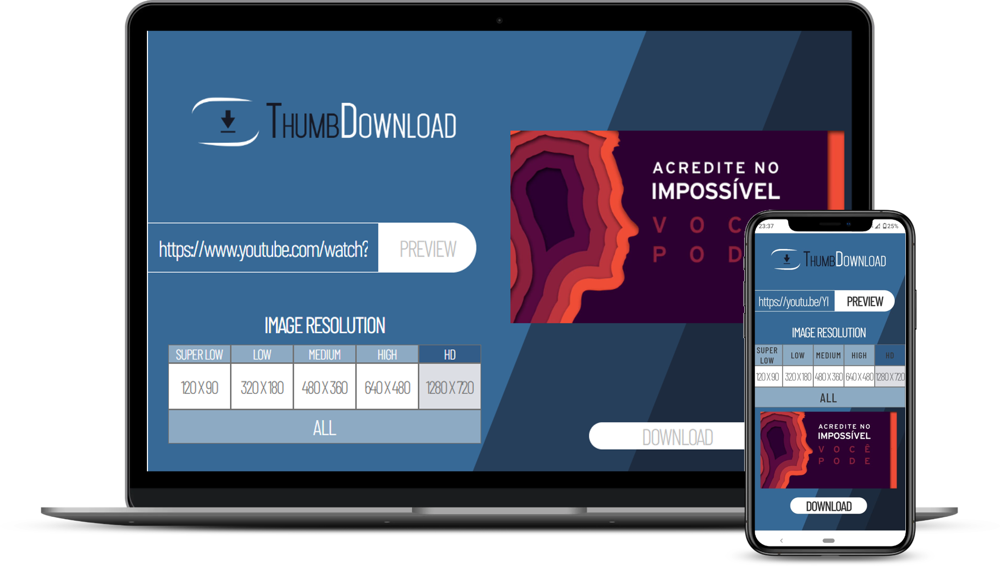

# ThumbDownload

Website to download Youtube thumbnails. You can see a preview of each thumbnail resolution before download it and download a Zip file with all of them.

Site: https://vlrtroll.github.io/ThumbDownload/

   
  

## 🗒 Study Topics
- No frameworks
- Responsive layout with Mobile First Method
- CSS animations
- Youtube URL validation
- Youtube thumbnails
- Zip files with Javascript

---

Made with ❤️ by <strong>VLRTroll :alien: 

